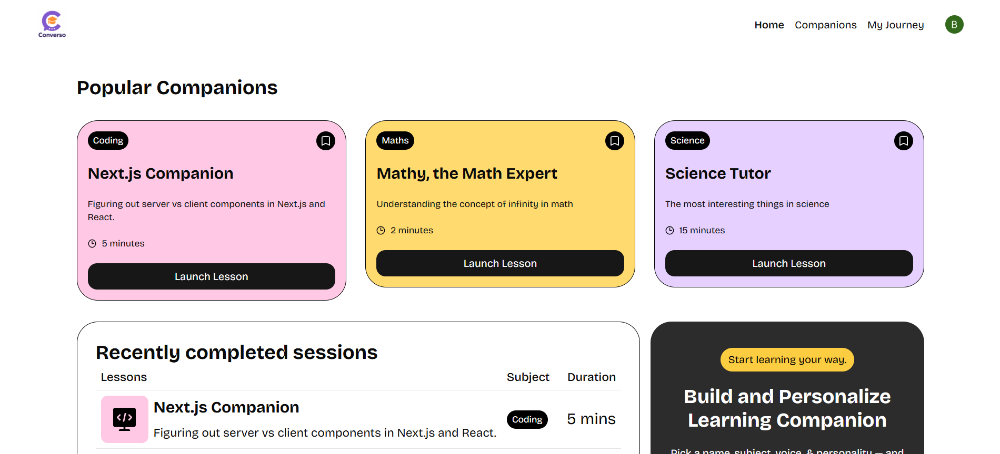

This is a [Next.js](https://nextjs.org) project bootstrapped with [`create-next-app`](https://nextjs.org/docs/app/api-reference/cli/create-next-app).

<div align="center">
  <br />
    <a href="" target="_blank">
      
    </a>
  <br />

## Getting Started

  <div>
    
    
    
  </div>
  <h3 align="center">SaaS App - LMS with Next.js, Supabase & Payments</h3>
</div>

## 📋 <a name="table">Table of Contents</a>

1. 🤖 [Introduction](#introduction)
2. ⚙️ [Tech Stack](#tech-stack)
3. 🔋 [Features](#features)
4. 🤸 [Quick Start](#quick-start)
5. 🔗 [Assets](#links)
6. 🚀 [More](#more)

## <a name="tech-stack">⚙️ Tech Stack</a>

- **[Clerk](https://clerk.com)** – <span class="text-purple-600">All-in-one authentication, user management, and billing platform with embeddable UI, API access, and subscription control.</span>

- **[Next.js](https://nextjs.org/)** – <span class="text-indigo-600">Full-stack React framework with SSR, static generation, and API routes for fast, scalable web apps.</span>

- **[Sentry](https://sentry.io/)** – <span class="text-red-600">Real-time error tracking and performance monitoring tool with alerts, stack traces, and diagnostics.</span>

- **[shadcn/ui](https://ui.shadcn.com/)** – <span class="text-teal-600">Accessible, customizable component library using Radix UI and Tailwind CSS for modern UI development.</span>

- **[Supabase](https://supabase.com/)** – <span class="text-green-600">Open-source backend platform with real-time PostgreSQL, auth, storage, and instant APIs.</span>

- **[Tailwind CSS](https://tailwindcss.com/)** – <span class="text-pink-600">Utility-first CSS framework for building custom UIs efficiently using predefined utility classes.</span>

- **[TypeScript](https://www.typescriptlang.org/)** – <span class="text-blue-600">JavaScript superset with static typing, enhancing code quality, readability, and developer productivity.</span>

- **[Vapi](https://jsm.dev/converso-vapi)** – <span class="text-orange-600">Voice AI platform for building real-time, multilingual voice agents with speech-to-text and TTS support.</span>

## <a name="features">🔋 Features</a>

👉 **AI Voice Agents**: Take tutoring sessions with voiced AIs specializing in the topics you want to get better at.

👉 **Authentication**: Secure user sign-up and sign-in with Clerk; Google authentication and many more.

👉 **Billing & Subscriptions**: Easily manage plans, upgrades, and payment details.

👉 **Bookmarks and Session History**: Let users organise their learning by bookmarking tutors and accessing previous sessions.

👉 **Code Reusability**: Leverage reusable components and a modular codebase for efficient development.

👉 **Create a Tutor**: Create your own AI tutors, choosing a subject, topic, and style of conversation.

👉 **Cross-Device Compatibility**: Fully responsive design that works seamlessly across all devices.

👉 **Database Integration**: Uses Supabase for real-time data handling and storage needs.

👉 **Modern UI/UX**: Clean, responsive design built with Tailwind CSS and shadcn/ui for a sleek user experience.

👉 **Scalable Tech Stack**: Built with Next.js for a fast, production-ready web application that scales seamlessly.

👉 **Search Functionality**: Find tutors quickly with robust filters and search bar.

## <a name="quick-start">🤸 Quick Start</a>

Follow these steps to set up the project locally on your machine.
**Prerequisites**
Make sure you have the following installed on your machine:

- [Git](https://git-scm.com/)
- [Node.js](https://nodejs.org/en)
- [npm](https://www.npmjs.com/) (Node Package Manager)
  **Cloning the Repository**

```bash
npm run dev
# or
yarn dev
# or
pnpm dev
# or
bun dev
git clone https://github.com/birhanu-dejen/saas-next
cd saas-app
```

Open [http://localhost:3000](http://localhost:3000) with your browser to see the result.
**Installation**
Install the project dependencies using npm:

You can start editing the page by modifying `app/page.tsx`. The page auto-updates as you edit the file.

```bash
npm install
```

**Set Up Environment Variables**
Create a new file named `.env` in the root of your project and add the following content:

```env
# Sentry
SENTRY_AUTH_TOKEN=
# Vapi
NEXT_PUBLIC_VAPI_WEB_TOKEN=
# Clerk
NEXT_PUBLIC_CLERK_PUBLISHABLE_KEY=
CLERK_SECRET_KEY=
NEXT_PUBLIC_CLERK_SIGN_IN_URL=/sign-in
NEXT_PUBLIC_CLERK_SIGN_IN_FALLBACK_REDIRECT_URL=/
NEXT_PUBLIC_CLERK_SIGN_UP_FALLBACK_REDIRECT_URL=/
# Supabase
NEXT_PUBLIC_SUPABASE_URL=
NEXT_PUBLIC_SUPABASE_ANON_KEY=
```

```bash
npm run dev
```
